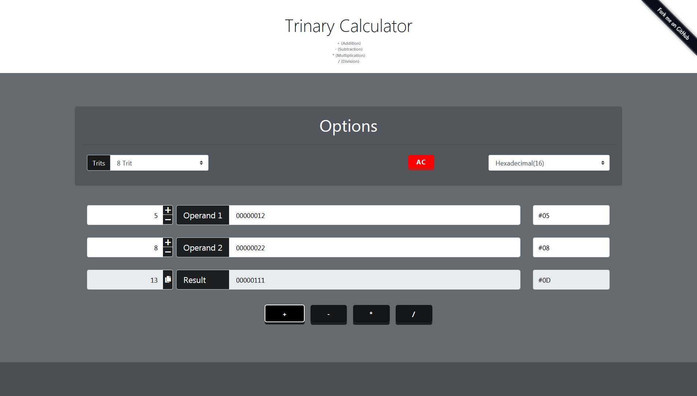

# 📱 [Trinary Calculator Android Java App](https://play.google.com/store/apps/details?id=com.trinarycalculator.ayidouble.trinarycalculator.app) 📱

<h1 align=center>

</h1>

A Completely **Free** handy Calculator for trinary operations 📱

**Official Google Play Store Download Link** : **[https://play.google.com/store/apps/details?id=com.trinarycalculator.ayidouble.trinarycalculator.app](https://play.google.com/store/apps/details?id=com.trinarycalculator.ayidouble.trinarycalculator.app)**

A handy **Calculator** for trinary operations, that works on **all devices**. 📱 💻 🖥

You can choose, if you want to calculate with **Balanced Ternary (-,0,+)** or **Trinary (0,1,2)**. 0️⃣1️⃣2️⃣ 

Feel free to use the **Calculator** for teaching Numeral systems as an example.
If you have Suggestions or find Errors, you're free to contact me on GitHub or submit your changes.
The Reason why I build this **Calculator** was, because there wasn't a good one on the Web.

## [📱 FREE Download Google Play Store: 📱](https://play.google.com/store/apps/details?id=com.trinarycalculator.ayidouble.trinarycalculator.app)

## [📱 Mobile (Smartphone): 📱](https://ayidouble.github.io/Trinary-Calculator-JavaScript)

## [💻 Desktop: 🖥](https://ayidouble.github.io/Trinary-Calculator-JavaScript)

**[The Trinary Calculator is just a Website](https://ayidouble.github.io/Trinary-Calculator-JavaScript)** that each possible device can access to. 
## ***You can use the Trinary Calculator on your: 📱 💻 🖥***
- ***[Smartphone](https://ayidouble.github.io/Trinary-Calculator-JavaScript) (Android/iOS etc.) 📱***
- ***[Tablet](https://ayidouble.github.io/Trinary-Calculator-JavaScript) (Chrome, Firefox, Edge, Safari) 📱***
- ***[Laptop](https://ayidouble.github.io/Trinary-Calculator-JavaScript) (Chrome, Firefox, Edge, Safari) 💻***
- ***[Desktop](https://ayidouble.github.io/Trinary-Calculator-JavaScript) (Chrome, Firefox, Edge, Safari) 🖥***

## Trinary Operations ➕ ➖ ➗ ✖️

- **\+ (Addition)**
- **\- (Subtraction)**
- **\* (Multiplication)**
- **\/ (Division)**

## As efficient as possible ⚙️

The **Calculator** is designed to give responses on every action,
this is noticeable as an example at the addition of two Trytes,
while you're typing, an algorithm already calculates every number you type and displays the result.

## The Calculator allows you to ⛓

- calculate with **balanced Ternary (-,0,+)** or **Trinary (0,1,2)** 0️⃣1️⃣2️⃣ 
- see how Binary Values are stored in Trinary
- how much **8, 16, 32, 64, 3, 6, 9, 21, 27, 81 Trit** can store, (ex. unsigned **8-Trit** can store values from **(00000000) 0 ... 6561 (22222222)**)
- see how other numeral systems are working (**ternary**, **quaternary**, **octal**, **hexadecimal**)
